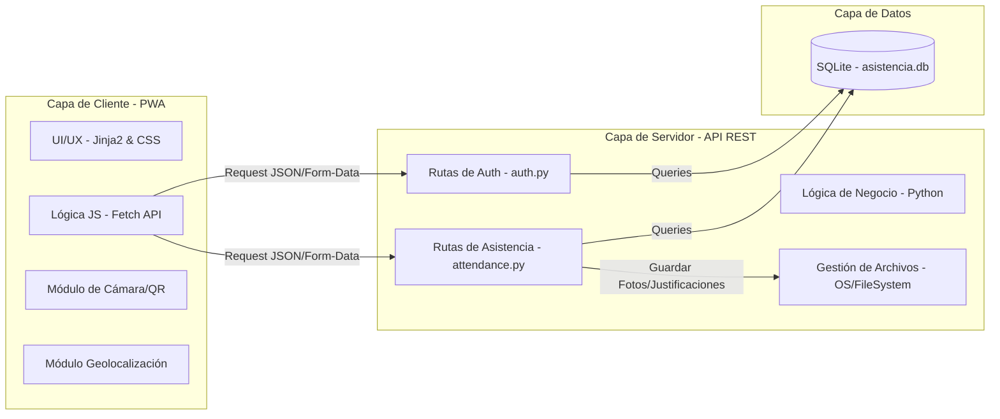
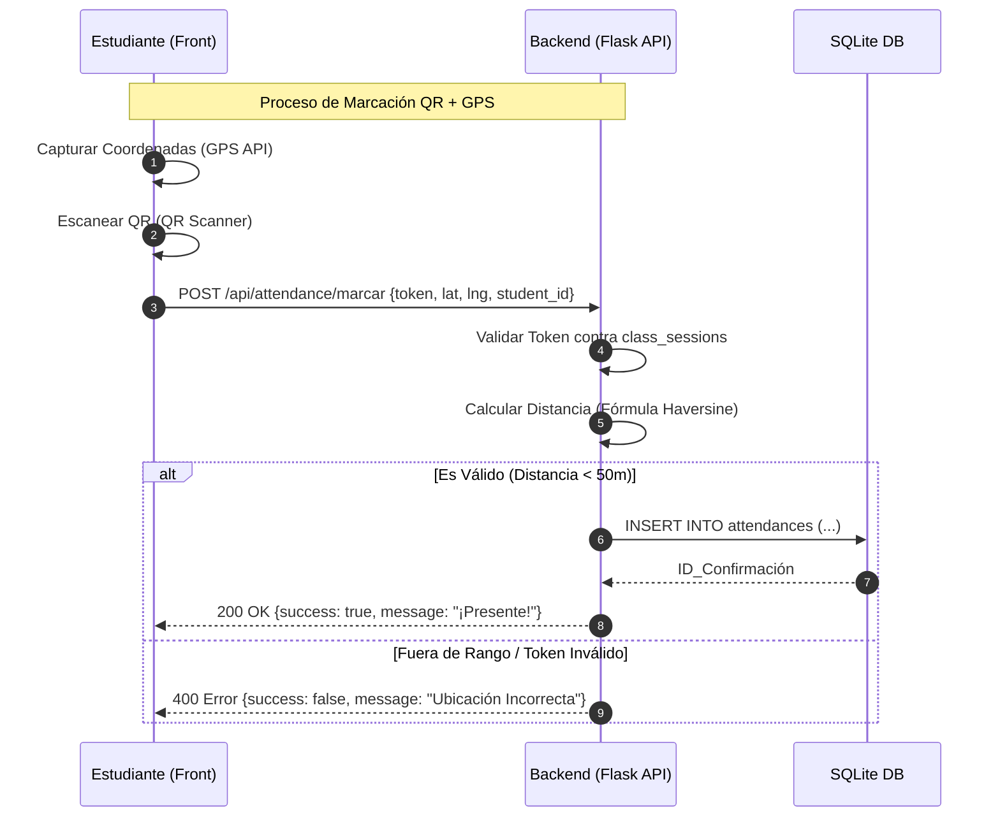
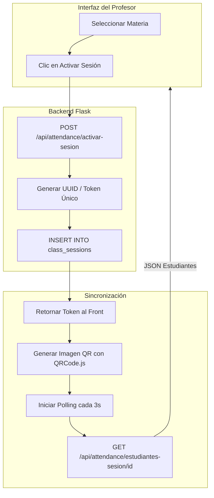
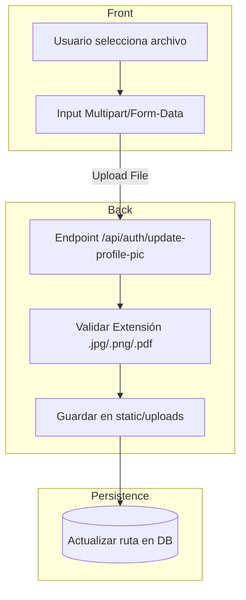

# Diagramas Técnicos Full-Stack - UNINPAHU Asistencia 📊🌐

Este documento detalla la arquitectura desacoplada entre el **Frontend (Cliente PWA)** y el **Backend (Servidor Flask)**.

---

## 1. Arquitectura de Componentes (Front vs Back)
Muestra la separación de responsabilidades y las tecnologías en cada capa.

---

## 2. Diagrama de Secuencia Detallado (Comunicación API)
Muestra el flujo exacto de una marcación de asistencia exitosa.

---

## 3. Flujo de Activación de Clase (Vista Docente)
Cómo el profesor habilita el sistema para sus alumnos.

---

## 4. Estructura de Datos y Flujo de Archivos
Cómo viajan las Justificaciones y Fotos de Perfil.

---

## 5. Resumen de Roles y Permisos
| Característica | Frontend (Estudiante) | Frontend (Profesor) | Backend (Validación) |
| :--- | :--- | :--- | :--- |
| **Asistencia** | Escanear / Ver Progreso | Activar / Ver Lista en Vivo | Verificar GPS & Token |
| **Perfiles** | Ver / Subir Foto | Ver / Subir Foto | Guardar Ruta en DB |
| **Justificaciones** | Subir Soportes | Revisar / Descargar | Mapear a Student_ID |
| **Citaciones** | Recibir Alerta Roja | Generar Alerta (Citar) | Notificar vía API |
