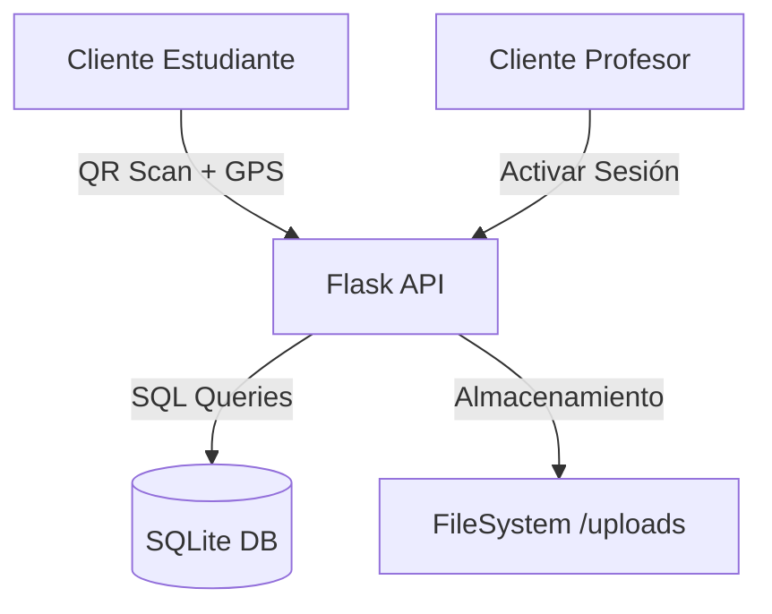

# UNINPAHU Asistencia - PWA de Gestión Académica 🎓🚀


**UNINPAHU Asistencia** es una solución integral de software diseñada para optimizar y asegurar el registro de asistencia en entornos universitarios. Utilizando tecnologías web modernas, el sistema ofrece una experiencia interactiva en tiempo real que combina la facilidad de uso con la seguridad institucional.

---

## 🌟 Visión General
El proyecto transforma el proceso tradicional de llamado a lista en una interacción digital dinámica. Los profesores generan sesiones de clase protegidas por geolocalización, y los estudiantes validan su presencia mediante escaneo de códigos QR, asegurando que el registro solo pueda realizarse dentro del campus universitario.

---

## ✨ Características de Alto Nivel

### 👨‍🎓 Portal Estudiantil
- **Validación Dual**: Verificación de ubicación GPS sincronizada con los campus de UNINPAHU.
- **Seguimiento de Progreso**: Indicadores visuales de porcentaje de asistencia para prevenir riesgos académicos.
- **Gestión de Excusas**: Módulo de carga de documentos (PDF/JPG) para justificación de inasistencias.
- **PWA Ready**: Acceso directo desde el escritorio del móvil con modo pantalla completa.

### 👨‍🏫 Panel Docente (Pro)
- **Control QR Dinámico**: Generación de tokens únicos con tiempo de expiración.
- **Monitoreo en Vivo**: Lista de asistentes que se actualiza automáticamente cada 3 segundos.
- **Intervención Temprana**: Sistema de alertas de deserción con botón de "Citación Académica".
- **Gestión Manual**: Capacidad de validar asistencia para casos especiales de fallos técnicos.

---

## 🛠️ Stack Tecnológico
- **Core**: Python 3.10+ & Flask.
- **Base de Datos**: SQLite3 con arquitectura relacional.
- **Frontend**: HTML5 Semántico, JavaScript ES6+, CSS3 (Glassmorphism & Tailwind-style utilities).
- **Assets**: PWA Manifest, Service Workers para caching y modo offline básico.

---

## 🏗️ Arquitectura del Proyecto


---

## 📦 Estructura del Repositorio
- **/Backend**: Lógica del servidor, rutas de API y gestión de base de datos.
- **/Frontend**: Plantillas HTML (Jinja2) y activos estáticos (CSS, JS, Imágenes).
- **/static/uploads**: Directorio seguro para fotos de perfil y justificaciones.
- **database_schema.md**: Documentación detallada de las 11 tablas del sistema.
- **api_endpoints.md**: Catálogo completo de las 15 rutas de la API REST.

---

## 🚀 Guía de Instalación Rápida

1. **Preparar el entorno**:
   ```bash
   git clone https://github.com/tu-usuario/asistencia-uninpahu.git
   cd asistencia-uninpahu
   ```

2. **Instalar Dependencias**:
   ```bash
   pip install -r requirements.txt
   ```

3. **Ejecutar el Servidor**:
   ```bash
   python Backend/app.py
   ```

4. **Acceso Local**:
   Navega a [http://localhost:5001](http://localhost:5001)

---

## 🧪 Pruebas Unitarias
El proyecto incluye una suite de pruebas para garantizar la estabilidad de la lógica matemática y de negocio.

Para ejecutar las pruebas (asegúrate de haber instalado los requerimientos):
```bash
python -m pytest tests/test_logic.py
```
Estas pruebas verifican:
- Precisión de la fórmula **Haversine** (Geolocalización).
- Integridad de los estados de asistencia.
- Lógica de autenticación.

---

## 🔒 Seguridad y Validaciones
- **Geofencing**: El sistema compara la latitud/longitud del usuario contra el centro de la sede universitaria con un margen de error configurable de 50 metros.
- **Sesiones Únicas**: Cada código QR es válido solo para una sesión y un horario específico, evitando registros fraudulentos desde fuera del aula.

**Desarrollado con ❤️ para la comunidad académica.**
