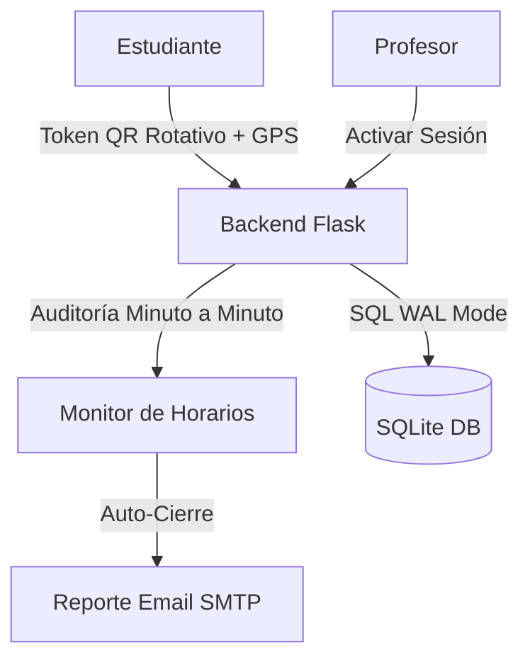

# UNINPAHU Asistencia - PWA de Gestión Académica 🎓🚀


**UNINPAHU Asistencia** es una solución integral de software diseñada para optimizar y asegurar el registro de asistencia en el entorno universitario de UNINPAHU, contribuyendo a una mejor gestión académica y la interacción entre docentes y estudiantes.

## 🌟 Visión General
El proyecto transforma el proceso tradicional de llamado a lista en una interacción digital dinámica. Los profesores generan sesiones de clase protegidas por **geolocalización** y **tokens de rotación viva**, asegurando que el registro sea imposible de falsificar mediante fotografías compartidas.

---

## ✨ Características de Vanguardia (UX Premium)

### 🎨 Suite de Diseño Institucional
- **Identidad Soft Peach**: Paleta de colores cálida basada en la marca UNINPAHU.
- **Glassmorphism UI**: Interfaz moderna basada en capas de cristal traslúcido.
- **Marca de Agua Nítida**: Fondo institucional suave pero 100% nítido.
- **Animaciones Avanzadas**: Transiciones de salida, efectos 3D Tilt y láser QR.

### 👨‍🎓 Portal Estudiantil
- **Validación Dual**: Verificación de ubicación GPS sincronizada con los campus de UNINPAHU.
- **Sincronización Offline**: Cola de persistencia local que guarda marcaciones sin internet y las sube automáticamente al recuperar conexión.
- **Seguimiento de Progreso**: Indicadores visuales de porcentaje de asistencia en tiempo real.
- **Gestión de Justificaciones**: Módulo de carga de soportes médicos/laborales (PDF/JPG).

### 👨‍🏫 Panel Docente (Pro)
- **Seguridad Viva (Anti-Fraude)**: El código QR rota automáticamente cada 15 segundos. Incluye una "ventana de gracia" de 60 segundos para validar escaneos recientes, neutralizando fotos compartidas por WhatsApp.
- **Monitoreo en Vivo**: Dashboard con actualización de asistentes cada 3 segundos.
- **Cierre Automático e Inteligente**: Un monitor en segundo plano audita los horarios y finaliza las clases exactamente cuando terminan cronológicamente.
- **Consolidación de Notificaciones (Anti-Spam)**: Filtrado inteligente en el backend para mostrar un único banner por evento, evitando saturación por rotación de tokens o alertas repetidas.
- **Reportes Automáticos por Email**: Al finalizar la clase, el docente recibe un reporte consolidado en HTML directamente en su correo institucional.
- **Migración Inteligente (Excel)**: Script importador que mapea dinámicamente columnas de un archivo institucional (formato OLE2), traduciendo automáticamente códigos de días, horas y asignando documentos de identidad como login.

---

## 🛠️ Stack Tecnológico
- **Backend**: Python 3.10+ & Flask.
- **Motor de Datos**: SQLite3 (Modo WAL para alta concurrencia) con integridad referencial activa.
- **Frontend**: HTML5, JS ES6+, CSS3 (Glassmorphism).
- **Notificaciones**: Sistema de Polling reactivo para alertas de citación y clases activas.

---

## 🏗️ Arquitectura de Seguridad


## 📦 Estructura del Proyecto
- **/Backend**: Rutas API, lógica de seguridad y el `monitor_de_horarios`.
- **/Frontend**: Plantillas PWA y activos estáticos optimizados.
- **/docs**: 
  - [📘 Manual de Usuario](docs/MANUAL_USUARIO.md): Guía para docentes y estudiantes.
  - [📊 Requerimientos de Integración](docs/requerimientos_tablas.md): Guía de tablas y campos para la universidad.
  - [📱 Configuración PWA](docs/PWA_SETUP.md): Pasos para instalar como aplicación nativa.
  - [🔑 Seguridad y QR](docs/asistencia.md): Detalles del flujo de rotación y validación.
  - [🗄️ Esquema de Base de Datos](docs/database_schema.md): Estructura de tablas y relaciones SQLite.
  - [🌐 API Endpoints](docs/api_endpoints.md): Documentación de rutas y parámetros.
  - [💾 Persistencia Offline](docs/persistencia.md): Funcionamiento del modo WAL y cola local.
  - [📥 Migración de Datos](docs/importacion_datos.md): Guía de carga masiva desde Excel.
  - [🧪 Guía de Pruebas](docs/credenciales_pruebas.md): Credenciales de prueba para validación de flujos.

---

## 🚀 Instalación y Despliegue en Render

El proyecto está optimizado para **Render**. Incluye:
- `render.yaml`: Configuración de infraestructura (IaC).
- `build.sh`: Script de instalación y preparación de DB automática.
- `requirements.txt`: Dependencias actualizadas para producción (Flask 3.0, Gunicorn).

**Pasos para Render:**
1. Conecta tu repositorio.
2. Render detectará el `render.yaml`.
3. **Variable de Entorno**: Asegura poner `PYTHON_VERSION` = `3.10.12`.
4. ¡Listo! El despliegue es automático.

**Instalación Local**:
```bash
pip install -r requirements.txt
python Backend/seed.py
python Backend/app.py
```

2. **Configurar Correo (Opcional)**:
   Edita las credenciales SMTP en `Backend/routes/attendance.py` para habilitar el envío real de reportes.

3. **Inicializar Datos (Pruebas)**:
   Si es la primera vez o deseas limpiar el sistema:
   ```bash
   python Backend/seed.py
   ```

4. **Iniciar**:
   ```bash
   python Backend/app.py
   ```
   Acceso: [http://localhost:5001](http://localhost:5001)

---

## 🔐 Credenciales de Prueba (Lógica Actualizada)
**Regla de Oro**: La contraseña de todos los usuarios es su mismo número de documento.

| Rol | Usuario (Documento) | Password |
| :--- | :--- | :--- |
| **Estudiante Master** | `202518003330` | `202518003330` |
| **Estudiante Test** | `2025100001` | `2025100001` |
| **Docente (Elfar)** | `elfar_morantes` | `elfar_morantes` |
| **Docente (Dakar)** | `dakar_sarmiento` | `dakar_sarmiento` |

---

## 🔒 Protocolos de Seguridad
1. **Geofencing**: Validación por radio de 100m (configurable) respecto a la sede.
2. **Dynamic QR**: El token cambia constantemente, haciendo obsoletas las capturas de pantalla.
3. **Grace Window**: Permite procesar escaneos legítimos que tardan unos segundos en viajar por la red tras un cambio de QR.