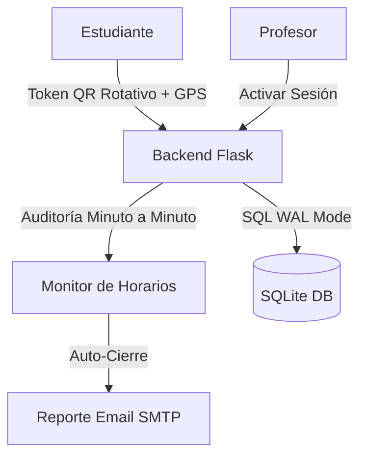

# UNINPAHU Asistencia - PWA de Gestión Académica 🎓🚀


**UNINPAHU Asistencia** es una solución integral de software diseñada para optimizar y asegurar el registro de asistencia en entornos universitarios. Utilizando tecnologías web modernas, el sistema ofrece una experiencia interactiva en tiempo real que combina la facilidad de uso con la seguridad institucional de grado bancario.

---

## 🌟 Visión General
El proyecto transforma el proceso tradicional de llamado a lista en una interacción digital dinámica. Los profesores generan sesiones de clase protegidas por **geolocalización** y **tokens de rotación viva**, asegurando que el registro sea imposible de falsificar mediante fotografías compartidas.

---

## ✨ Características de Vanguardia

### 👨‍🎓 Portal Estudiantil
- **Validación Dual**: Verificación de ubicación GPS sincronizada con los campus de UNINPAHU.
- **Sincronización Offline**: Cola de persistencia local que guarda marcaciones sin internet y las sube automáticamente al recuperar conexión.
- **Seguimiento de Progreso**: Indicadores visuales de porcentaje de asistencia en tiempo real.
- **Gestión de Justificaciones**: Módulo de carga de soportes médicos/laborales (PDF/JPG).

### 👨‍🏫 Panel Docente (Pro)
- **Seguridad Viva (Anti-Fraude)**: El código QR rota automáticamente cada 15 segundos. Incluye una "ventana de gracia" de 60 segundos para validar escaneos recientes, neutralizando fotos compartidas por WhatsApp.
- **Monitoreo en Vivo**: Dashboard con actualización de asistentes cada 3 segundos.
- **Cierre Automático e Inteligente**: Un monitor en segundo plano audita los horarios y finaliza las clases exactamente cuando terminan cronológicamente.
- **Reportes Automáticos por Email**: Al finalizar la clase, el docente recibe un reporte consolidado en HTML directamente en su correo institucional.

---

## 🛠️ Stack Tecnológico
- **Backend**: Python 3.10+ & Flask.
- **Motor de Datos**: SQLite3 (Modo WAL para alta concurrencia) con integridad referencial activa.
- **Frontend**: HTML5, JS ES6+, CSS3 (Glassmorphism).
- **Notificaciones**: Sistema de Polling reactivo para alertas de citación y clases activas.

---

## 🏗️ Arquitectura de Seguridad


---

## 📦 Estructura del Proyecto
- **/Backend**: Rutas API, lógica de seguridad y el `monitor_de_horarios`.
- **/Frontend**: Plantillas PWA y activos estáticos optimizados.
- **/docs**: 
  - [asistencia.md](file:///d:/Desktop/U/asistencia%20uninpahu/Gestor%20de%20Asistencia%20Universidad/docs/asistencia.md): Detalles del flujo de seguridad y rotación QR.
  - [persistencia.md](file:///d:/Desktop/U/asistencia%20uninpahu/Gestor%20de%20Asistencia%20Universidad/docs/persistencia.md): Documentación del modo WAL y cola offline.

---

## 🚀 Instalación y Despliegue

1. **Clonar e Instalar**:
   ```bash
   pip install -r requirements.txt
   ```

2. **Configurar Correo (Opcional)**:
   Edita las credenciales SMTP en `Backend/routes/attendance.py` para habilitar el envío real de reportes.

3. **Iniciar**:
   ```bash
   python Backend/app.py
   ```
   Acceso: [http://localhost:5001](http://localhost:5001)

---

## 🔒 Protocolos de Seguridad
1. **Geofencing**: Validación por radio de 100m (configurable) respecto a la sede.
2. **Dynamic QR**: El token cambia constantemente, haciendo obsoletas las capturas de pantalla.
3. **Grace Window**: Permite procesar escaneos legítimos que tardan unos segundos en viajar por la red tras un cambio de QR.

**Desarrollado con ❤️ para la comunidad académica de UNINPAHU.**
