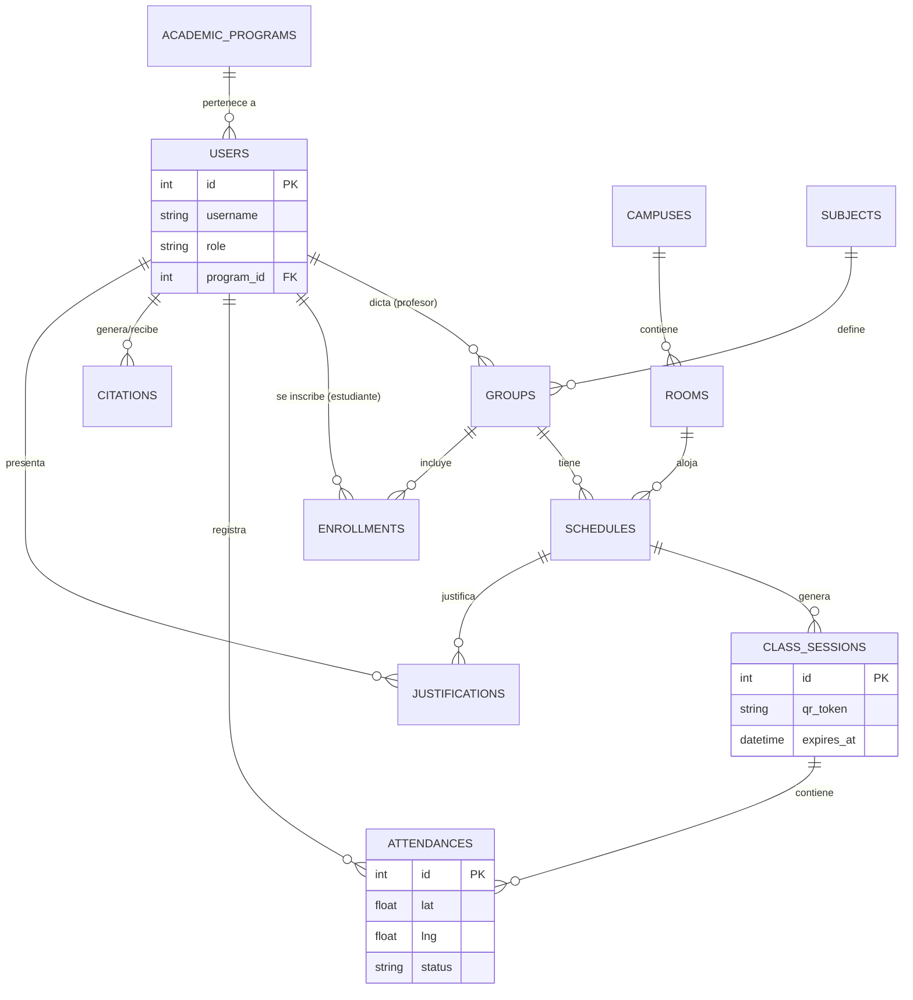

# Estructura de Base de Datos Final - UNINPAHU Asistencia 🗄️

Este documento detalla la arquitectura completa de la base de datos SQLite (`asistencia.db`). Se ha actualizado para reflejar la implementación real que soporta geofencing, gestión académica y seguimiento de citaciones.

## 📊 Diagrama de Entidad-Relación (ERD)



---

## 1. Tabla: `academic_programs` (Programas Académicos)
Almacena las facultades o carreras de la universidad.

| Campo | Tipo | Descripción |
| :--- | :--- | :--- |
| `id` | INTEGER | Llave primaria. |
| `name` | TEXT | Nombre del programa (ej: Ingeniería de Software). |
| `code` | TEXT | Código único del programa. |

---

## 2. Tabla: `users` (Usuarios)
Estudiantes, profesores y administradores.

| Campo | Tipo | Descripción |
| :--- | :--- | :--- |
| `id` | INTEGER | Llave primaria. |
| `username` | TEXT | Código institucional o ID de acceso. |
| `password` | TEXT | Contraseña (en texto plano para este prototipo). |
| `full_name` | TEXT | Nombre completo. |
| `role` | TEXT | `estudiante`, `profesor` o `admin`. |
| `program_id` | INTEGER | Vínculo con `academic_programs`. |
| `profile_pic`| TEXT | Ruta relativa de la foto de perfil. |

---

## 3. Tabla: `campuses` (Sedes)
Ubicaciones geográficas de la universidad.

| Campo | Tipo | Descripción |
| :--- | :--- | :--- |
| `id` | INTEGER | Llave primaria. |
| `name` | TEXT | Nombre de la sede. |
| `latitude` | REAL | Latitud central. |
| `longitude`| REAL | Longitud central. |
| `radius_meters`| INTEGER | Radio permitido para marcar asistencia (ej: 100m). |

---

## 4. Tabla: `rooms` (Salones)
Aulas físicas vinculadas a una sede.

| Campo | Tipo | Descripción |
| :--- | :--- | :--- |
| `id` | INTEGER | Llave primaria. |
| `code` | TEXT | Código del salón (ej: 301, Auditorio). |
| `campus_id` | INTEGER | Vínculo con `campuses`. |

---

## 5. Tabla: `subjects` (Asignaturas)
Catálogo de materias.

| Campo | Tipo | Descripción |
| :--- | :--- | :--- |
| `id` | INTEGER | Llave primaria. |
| `code` | TEXT | Código único de la materia (ej: IS1791). |
| `name` | TEXT | Nombre de la materia. |

---

## 6. Tabla: `groups` (Grupos)
Instancias de materias con un docente y periodo específico.

| Campo | Tipo | Descripción |
| :--- | :--- | :--- |
| `id` | INTEGER | Llave primaria. |
| `group_number`| TEXT | Número de grupo (ej: 750). |
| `subject_id`| INTEGER | Vínculo con `subjects`. |
| `teacher_id`| INTEGER | Vínculo con `users` (Profesor). |
| `start_date` | TEXT | Fecha de inicio del curso (YYYY-MM-DD). |
| `end_date`   | TEXT | Fecha de fin del curso (YYYY-MM-DD). |
| `jornada`    | TEXT | Diurna, Nocturna, Sabatina. |

---

## 7. Tabla: `schedules` (Horarios)
Días y horas de clase para cada grupo.

| Campo | Tipo | Descripción |
| :--- | :--- | :--- |
| `id` | INTEGER | Llave primaria. |
| `group_id`  | INTEGER | Vínculo con `groups`. |
| `room_id`   | INTEGER | Vínculo con `rooms`. |
| `day`       | TEXT | Día de la semana (M, T, W, R, F, S, U). |
| `start_time`| TEXT | Hora de inicio (HH:MM). |
| `end_time`  | TEXT | Hora de fin (HH:MM). |

---

## 8. Tabla: `enrollments` (Inscripciones)
Relación muchos a muchos entre estudiantes y grupos.

| Campo | Tipo | Descripción |
| :--- | :--- | :--- |
| `id` | INTEGER | Llave primaria. |
| `student_id`| INTEGER | Vínculo con `users`. |
| `group_id`  | INTEGER | Vínculo con `groups`. |

---

## 9. Tabla: `class_sessions` (Sesiones Generadas)
Instancias de clase activadas por el profesor.

| Campo | Tipo | Descripción |
| :--- | :--- | :--- |
| `id` | INTEGER | Llave primaria. |
| `schedule_id`| INTEGER | Vínculo con el horario. |
| `qr_token`  | TEXT | UUID único para el escaneo. |
| `expires_at` | TEXT | Timestamp de expiración del token. |
| `created_at` | TIMESTAMP| Fecha de creación. |
| `is_active` | INTEGER | Estado de la sesión (1=Activa, 0=Cerrada). |

---

## 10. Tabla: `attendances` (Registros de Asistencia)
Marcas de asistencia de los estudiantes.

| Campo | Tipo | Descripción |
| :--- | :--- | :--- |
| `id` | INTEGER | Llave primaria. |
| `student_id`| INTEGER | Vínculo con `users`. |
| `session_id`| INTEGER | Vínculo con `class_sessions`. |
| `timestamp` | TIMESTAMP| Hora exacta del marcado. |
| `lat` / `lng`| REAL | Coordenadas reportadas por el estudiante. |
| `distance_to_campus`| REAL| Distancia calculada al campus. |
| `status`    | TEXT | `Presente`, `manual` o `justificada`. |

---

## 11. Tabla: `citations` (Citaciones Académicas)
Alertas generadas por profesores para estudiantes en riesgo.

| Campo | Tipo | Descripción |
| :--- | :--- | :--- |
| `id` | INTEGER | Llave primaria. |
| `teacher_id`| INTEGER | Quien genera la alerta. |
| `student_id`| INTEGER | Estudiante citado. |
| `message`   | TEXT | Motivo de la citación. |
| `status`    | TEXT | `activa` o `resuelta`. |
| `timestamp` | DATETIME| Fecha de generación. |

---

## 12. Tabla: `justifications` (Justificaciones)
Soportes de inasistencia cargados por alumnos.

| Campo | Tipo | Descripción |
| :--- | :--- | :--- |
| `id` | INTEGER | Llave primaria. |
| `student_id`| INTEGER | Alumno que justifica. |
| `schedule_id`| INTEGER | Clase a la que faltó. |
| `file_path` | TEXT | Ruta al archivo subido. |
| `status`    | TEXT | `pendiente`, `aprobada`, `rechazada`. |
| `timestamp` | TIMESTAMP| Fecha de subida. |

---

## 🔍 Consultas de Ejemplo (Joins Comunes)

### A. Obtener el quórum de una sesión (Profesor)
```sql
SELECT s.name, COUNT(a.id) as presentes, (SELECT COUNT(*) FROM enrollments WHERE group_id = g.id) as inscritos
FROM class_sessions cs
JOIN schedules sch ON cs.schedule_id = sch.id
JOIN groups g ON sch.group_id = g.id
JOIN subjects s ON g.subject_id = s.id
LEFT JOIN attendances a ON a.session_id = cs.id
WHERE cs.id = ?;
```

### B. Validar ubicación del estudiante contra el campus
```sql
SELECT c.latitude, c.longitude, c.radius_meters 
FROM class_sessions cs
JOIN schedules sch ON cs.schedule_id = sch.id
JOIN rooms r ON sch.room_id = r.id
JOIN campuses c ON r.campus_id = c.id
WHERE cs.qr_token = ?;
```
