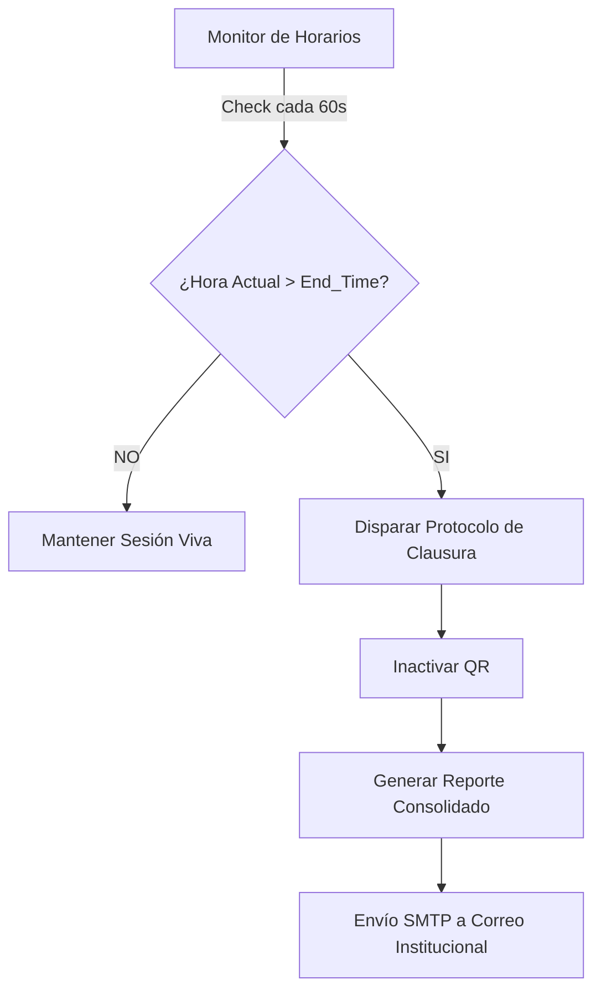

# 🛡️ Protocolos de Asistencia y Seguridad
> **Módulo**: Validación Dinámica | **Algoritmos**: Haversine + Totp-Like Rotation

Este documento detalla los mecanismos de seguridad implementados para garantizar la integridad del registro de asistencia, neutralizando intentos de fraude y automatizando la auditoría académica.

---

## 🔑 1. Rotación Viva de QR (Anti-Proxy)

Para evitar que un estudiante ausente marque asistencia mediante una foto enviada por un tercero, el sistema implementa una rotación de tokens de alta frecuencia.

| Parámetro | Valor | Descripción |
| :--- | :--- | :--- |
| **Intervalo de Rotación** | 15 Segundos | Tiempo de vida de un QR en pantalla. |
| **Ventana de Gracia** | 60 Segundos | Margen para procesar escaneos en tránsito (latencia). |
| **Algoritmo de Hash** | UUID v4 | Tokens no predecibles generados dinámicamente. |

> [!IMPORTANT]
> **VENTANA DE GRACIA (Grace Window)**: El servidor mantiene en memoria los últimos 4 tokens generados. Esto asegura que si el QR rota mientras el estudiante está procesando el envío, el registro no sea rechazado injustamente.

---

## 🌍 2. Validación Espacial (Geofencing)

El sistema utiliza la **Fórmula de Haversine** para calcular la distancia ortodrómica entre dos puntos de una esfera (la Tierra) a partir de sus longitudes y latitudes.

### Sedes Configuradas (Campus UNINPAHU)

| Sede | Latitud | Longitud | Radio Tolerancia |
| :--- | :--- | :--- | :--- |
| **Teusaquillo** | `4.6300` | `-74.0684` | 100 Metros |
| **Principal** | `4.6318` | `-74.0665` | 100 Metros |
| **Parkway** | `4.6310` | `-74.0685` | 120 Metros |

> [!TIP]
> Si el estudiante se encuentra a una distancia mayor al radio permitido respecto a **cualquiera** de las sedes institucionales, el servidor arrojará un error de `FUERA_DE_RANGO` y bloqueará el registro.

---

## 🤖 3. Monitor de Horarios (Cierre Autónomo)

El backend ejecuta un proceso daemon encargado de auditar la vida de las sesiones académicas para garantizar el envío de reportes, incluso si el docente olvida cerrar la sesión.



### Flujo de Decisión (ASCII)
```text
[ Monitor de Horarios ]
          |
    (Check cada 60s)
          |
          v
  /-----------------\
  | ¿Hora Actual >  |--- NO ---> [ Mantener Sesión Viva ]
  |   End_Time?     |
  \-----------------/
          |
        ( SI )
          |
          v
  [ Protocolo de Clausura ]
          |
          v
  [ Inactivar Token QR  ]
          |
          v
  [ Generar Consolidado ]
          |
          v
  [ Envío Email Docente ]
```

---

## 🔍 Resumen de Reglas de Marcado

1.  **Sincronía Temporal**: Solo se aceptan marcaciones durante el bloque horario oficial del grupo.
2.  **Unicidad Estricta**: Un `student_id` no puede tener más de una entrada exitosa para la misma `session_id`.
3.  **Auditoría de Ubicación**: Cada registro de asistencia (`attendances`) guarda la distancia exacta (en metros) que el estudiante tenía respecto al centro de la sede al momento del marcado.

> [!NOTE]
> **Integridad de Datos**: Los reportes automáticos se envían en formato HTML enriquecido, facilitando la lectura directa desde dispositivos móviles por parte del docente.

---

## 📱 4. Mi Código QR (Identificación Estudiantil)

Para facilitar los registros manuales por parte del docente (en casos de fallos de red o problemas con el dispositivo del estudiante), cada estudiante cuenta con un botón **"Mi QR"** en su portal. 

Al accionarlo, el sistema genera dinámicamente un código QR utilizando un servicio externo, encriptando su identificación (ID/Username) para que el profesor pueda escanearlo directamente desde su dispositivo y validarlo en su lista.

### Flujo de Identificación (ASCII)
```text
[ Perfil de Estudiante ]
           |
           v
      ( Clic en "Mi QR" )
           |
           v
 /-------------------------\
 |  Petición a API Externa |
 |  (api.qrserver.com)     |
 \-------------------------/
           |
           v
[ Despliegue de Modal QR ]
           |
           v
[ Profesor Escanea el QR  ] ---> [ Validación en Backend ] ---> [ Registro Manual Exitoso ]
```

### Escáner Continuo (Lado Docente)
Para procesar las filas de estudiantes de manera rápida, el profesor cuenta con un escáner que funciona en **modo continuo**. 

- **Optimización Anti-Spam**: El escáner incluye un temporizador (3000ms) para ignorar escaneos repetidos del mismo QR, evitando recargar el backend con llamadas redundantes.
- **Feedback Sensorial**: Al escanear a un alumno exitosamente, la interfaz provee un cambio visual y un patrón de vibración (`navigator.vibrate`) que confirma la acción, de forma que el profesor no necesite mirar la pantalla para cada estudiante validado.
