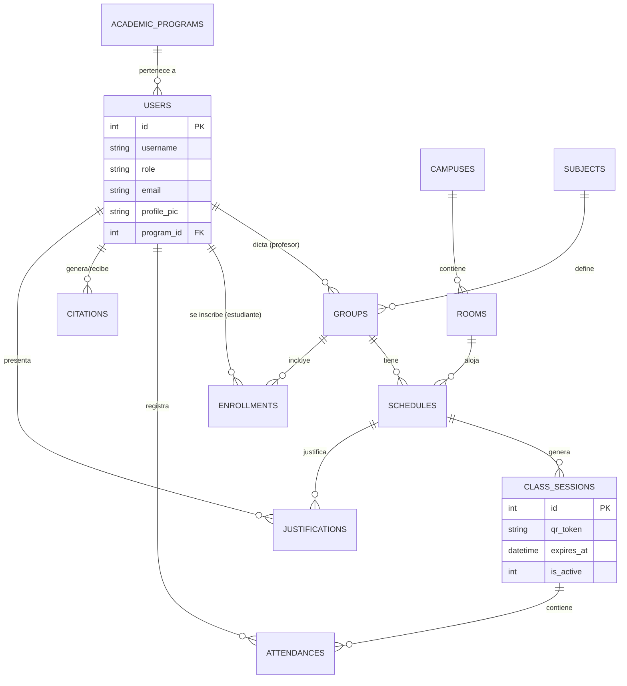

# Estructura de Base de Datos Final - UNINPAHU Asistencia 🗄️

Este documento detalla la arquitectura completa de la base de datos SQLite (`asistencia.db`). Se ha actualizado para reflejar la implementación real que soporta geofencing, gestión académica, seguimiento de citaciones y reportes automáticos por email.

## ⚡ Rendimiento y Concurrencia (Modo WAL)
La base de datos opera en modo **Write-Ahead Logging (WAL)**. Esto permite:
1.  **Lecturas y Escrituras Concurrentes**: Los estudiantes pueden marcar asistencia (Escritura) sin bloquear a otros estudiantes que consultan su progreso (Lectura).
2.  **Persistencia Robusta**: Minimiza el riesgo de corrupción de datos ante fallos del servidor.
3.  **Integridad**: Soporte completo para llaves foráneas mediante `PRAGMA foreign_keys = ON`.

## 📊 Diagrama de Entidad-Relación (ERD)

---

## 1. Tabla: `academic_programs` (Programas Académicos)
Almacena las facultades o carreras de la universidad.

| Campo | Tipo | Descripción |
| :--- | :--- | :--- |
| `id` | INTEGER | Llave primaria. |
| `name` | TEXT | Nombre del programa (ej: Ingeniería de Software). |
| `code` | TEXT | Código único del programa. |

---

## 2. Tabla: `users` (Usuarios)
Estudiantes, profesores y administradores.

| Campo | Tipo | Descripción |
| :--- | :--- | :--- |
| `id` | INTEGER | Llave primaria. |
| `username` | TEXT | Código institucional o ID de acceso. |
| `password` | TEXT | Contraseña (encriptada o plana según implementación). |
| `full_name` | TEXT | Nombre completo. |
| `email` | TEXT | **Correo institucional (Vital para reportes automáticos)**. |
| `role` | TEXT | `estudiante`, `profesor` o `admin`. |
| `program_id` | INTEGER | Vínculo con `academic_programs`. |
| `profile_pic`| TEXT | Ruta relativa de la foto de perfil en `/static/uploads`. |

---

## 3. Tabla: `campuses` (Sedes)
Ubicaciones geográficas de la universidad para validación de Geofencing.

| Campo | Tipo | Descripción |
| :--- | :--- | :--- |
| `id` | INTEGER | Llave primaria. |
| `name` | TEXT | Nombre de la sede. |
| `latitude` | REAL | Latitud central para el radio de validación. |
| `longitude`| REAL | Longitud central para el radio de validación. |
| `radius_meters`| INTEGER | Margen de tolerancia (ej: 100m). |

---

## 4. Tabla: `class_sessions` (Sesiones de Asistencia)
Instancias de clase activadas por el profesor donde el QR es dinámico.

| Campo | Tipo | Descripción |
| :--- | :--- | :--- |
| `id` | INTEGER | Llave primaria. |
| `schedule_id`| INTEGER | Vínculo con el horario académico. |
| `qr_token`  | TEXT | Token UUID actual (Rotativo cada 15s). |
| `expires_at` | TEXT | Timestamp de expiración del token vivo. |
| `is_active` | INTEGER | `1` si la clase está abierta, `0` si se cerró (manual o auto). |

---

## 5. Tabla: `attendances` (Registros de Marcado)
Datos de asistencia capturados en tiempo real.

| Campo | Tipo | Descripción |
| :--- | :--- | :--- |
| `id` | INTEGER | Llave primaria. |
| `student_id`| INTEGER | Estudiante que marca. |
| `session_id`| INTEGER | Sesión vinculada. |
| `lat` / `lng`| REAL | Coordenadas capturadas por el GPS del móvil. |
| `distance_to_campus`| REAL| Distancia calculada mediante fórmula Haversine. |
| `status`    | TEXT | `Presente`, `manual` o `justificada`. |

---

## 🔍 Reglas de Integridad Referencial
- **ON DELETE CASCADE** no se aplica para mantener historial académico, excepto en sesiones temporales.
- El sistema utiliza **Unicidad de Marcado** (`UNIQUE(student_id, session_id)`) para evitar que un estudiante registre su asistencia más de una vez por clase.
