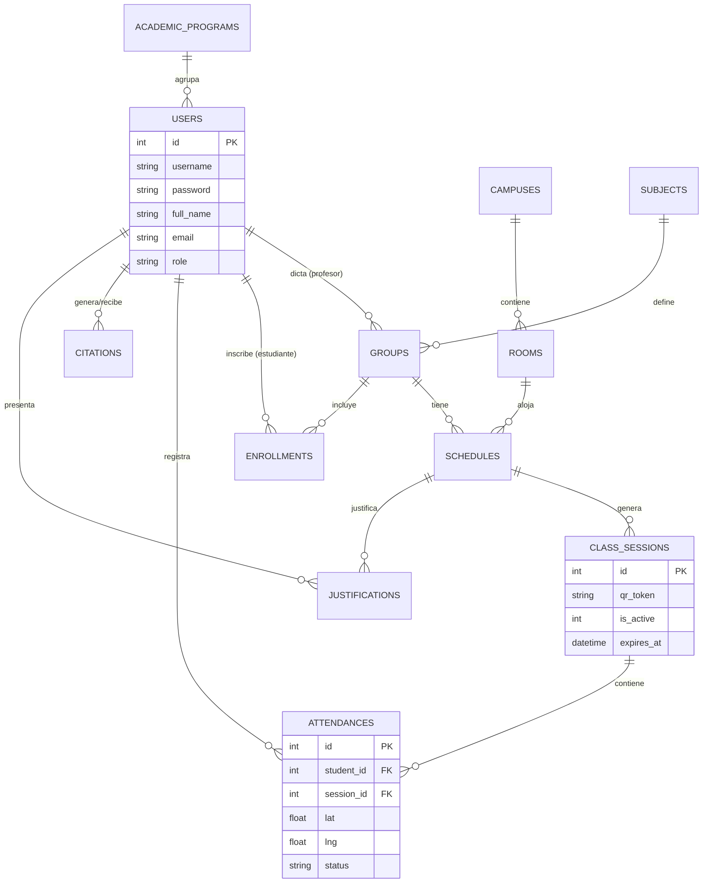

# 🗄️ Arquitectura de Datos de Grado Institucional
> **Proyecto**: UNINPAHU Asistencia | **Versión**: 2.1 | **Estado**: Producción (WAL Mode Active)

Este documento detalla la estructura neurálgica de la base de datos SQLite (`asistencia.db`). Diseñada bajo principios de normalización de tercera forma (3NF) y optimizada para alta disponibilidad.

---

> [!IMPORTANT]
> **MODO DE ALTA DISPONIBILIDAD (WAL)**
> El motor opera bajo el protocolo **Write-Ahead Logging**. Esto garantiza que las escrituras concurrentes no bloqueen las consultas, logrando una latencia mínima.

---

## 📊 Diagrama de Entidad-Relación Integral (ERD)



---

## 🧩 Trazabilidad de Asistencia (Flujo de Datos)

```ascii
[ ATTENDANCES ] --> [ CLASS_SESSIONS ] --> [ SCHEDULES ] --> [ GROUPS ] --> [ SUBJECTS ]
```

---

## 🛠️ Diccionario de Tablas (Iconografía Cromática)

> **Leyenda de Tipos:** 🟢 `INT` | 🔵 `TEXT` | 🟡 `REAL` | 🆔 `PK` | 🗝️ `FK`

---

### 1. `academic_programs` 📚
*Gestión de facultades y carreras universitarias.*

| Propiedad | Tipo | Descripción |
| :--- | :--- | :--- |
| 🆔 **id** | 🟢 `INT` | Identificador único (Auto-incremental). |
| 🏷️ **name** | 🔵 `TEXT` | Nombre oficial de la carrera/facultad. |
| 🔑 **code** | 🔵 `TEXT` | Código administrativo único. |

---

### 2. `users` 👤
*Entidad central de identidad (Estudiantes/Profesores).*

| Propiedad | Tipo | Descripción |
| :--- | :--- | :--- |
| 🆔 **id** | 🟢 `INT` | Llave primaria. |
| 👤 **username** | 🔵 `TEXT` | Código institucional (Único). |
| 🔒 **password** | 🔵 `TEXT` | Hash de seguridad de la cuenta. |
| 📛 **full_name** | 🔵 `TEXT` | Nombre y apellidos completos. |
| 📧 **email** | 🔵 `TEXT` | **Correo para reportes automáticos**. |
| 🎭 **role** | 🔵 `TEXT` | `estudiante`, `profesor` o `admin`. |
| 🗝️ **program_id**| 🟢 `INT` | Vínculo con `academic_programs`. |
| 🖼️ **profile_pic**| 🔵 `TEXT` | Ruta a imagen en `/static/uploads`. |

---

### 3. `campuses` 🏛️
*Sedes físicas configuradas para Geofencing.*

| Propiedad | Tipo | Descripción |
| :--- | :--- | :--- |
| 🆔 **id** | 🟢 `INT` | Llave primaria. |
| 🏫 **name** | 🔵 `TEXT` | Nombre de la sede (Ej: Parkway). |
| 📍 **latitude** | 🟡 `REAL` | Coordenada Y para validación. |
| 📍 **longitude**| 🟡 `REAL` | Coordenada X para validación. |
| 📏 **radius** | 🟢 `INT` | Radio de tolerancia en metros. |

---

### 4. `rooms` 🚪
*Salones y laboratorios vinculados a sedes.*

| Propiedad | Tipo | Descripción |
| :--- | :--- | :--- |
| 🆔 **id** | 🟢 `INT` | Llave primaria. |
| 🆔 **code** | 🔵 `TEXT` | Nombre del salón (Ej: Lab-201). |
| 🗝️ **campus_id** | 🟢 `INT` | Sede a la que pertenece el salón. |

---

### 5. `subjects` 📖
*Catálogo maestro de asignaturas.*

| Propiedad | Tipo | Descripción |
| :--- | :--- | :--- |
| 🆔 **id** | 🟢 `INT` | Llave primaria. |
| 🔑 **code** | 🔵 `TEXT` | Código único de la materia. |
| 📘 **name** | 🔵 `TEXT` | Nombre de la asignatura. |

---

### 6. `groups` 👥
*Grupos específicos vinculados a un docente.*

| Propiedad | Tipo | Descripción |
| :--- | :--- | :--- |
| 🆔 **id** | 🟢 `INT` | Llave primaria. |
| 🔢 **group_num** | 🔵 `TEXT` | Código de sección (Ej: N1A). |
| 🗝️ **subject_id** | 🟢 `INT` | Materia vinculada. |
| 🗝️ **teacher_id** | 🟢 `INT` | Docente asignado al grupo. |
| 📅 **start_date** | 🔵 `TEXT` | Inicio del semestre (ISO). |
| 📅 **end_date**   | 🔵 `TEXT` | Cierre del semestre (ISO). |
| 🕒 **jornada**    | 🔵 `TEXT` | Diurna, Nocturna, Sabatina. |

---

### 7. `schedules` ⏰
*Definición temporal de cada encuentro.*

| Propiedad | Tipo | Descripción |
| :--- | :--- | :--- |
| 🆔 **id** | 🟢 `INT` | Llave primaria. |
| 🗝️ **group_id** | 🟢 `INT` | Grupo al que pertenece el horario. |
| 🗝️ **room_id**  | 🟢 `INT` | Salón asignado. |
| 📅 **day**      | 🔵 `TEXT` | Día de la semana (M, T, W...). |
| 🕘 **start_time**| 🔵 `TEXT` | Hora de inicio (HH:MM). |
| 🕙 **end_time**  | 🔵 `TEXT` | Hora de fin (HH:MM). |

---

### 8. `enrollments` 📝
*Matrícula activa de estudiantes.*

| Propiedad | Tipo | Descripción |
| :--- | :--- | :--- |
| 🆔 **id** | 🟢 `INT` | Llave primaria. |
| 🗝️ **student_id**| 🟢 `INT` | Estudiante inscrito. |
| 🗝️ **group_id**  | 🟢 `INT` | Grupo matriculado. |

---

### 9. `class_sessions` ⚡
*Sesiones vivas con QR rotativo.*

| Propiedad | Tipo | Descripción |
| :--- | :--- | :--- |
| 🆔 **id** | 🟢 `INT` | Llave primaria. |
| 🗝️ **schedule_id**| 🟢 `INT` | Horario que activó la sesión. |
| 📲 **qr_token**  | 🔵 `TEXT` | Token actual (Cambiante cada 15s). |
| ⌛ **expires_at** | 🔵 `TEXT` | Tiempo de vida del token actual. |
| 🔘 **is_active** | 🟢 `INT` | `1` Abierta \| `0` Cerrada. |

---

### 10. `attendances` ✅
*Registros definitivos de asistencia.*

| Propiedad | Tipo | Descripción |
| :--- | :--- | :--- |
| 🆔 **id** | 🟢 `INT` | Llave primaria. |
| 🗝️ **student_id**| 🟢 `INT` | Estudiante que marcó. |
| 🗝️ **session_id**| 🟢 `INT` | Sesión vinculada. |
| 📍 **lat / lng** | 🟡 `REAL` | Coordenadas del móvil. |
| 📏 **distance**  | 🟡 `REAL` | Distancia calculada vs Sede. |
| 🚦 **status**    | 🔵 `TEXT` | `Presente`, `Manual`, `Justificada`. |

---

### 11. `citations` 🔔
*Alertas preventivas y llamados del docente.*

| Propiedad | Tipo | Descripción |
| :--- | :--- | :--- |
| 🆔 **id** | 🟢 `INT` | Llave primaria. |
| 🗝️ **teacher_id**| 🟢 `INT` | Emisor de la alerta. |
| 🗝️ **student_id**| 🟢 `INT` | Receptor de la alerta. |
| 💬 **message**   | 🔵 `TEXT` | Contenido de la citación. |
| 🚩 **status**    | 🔵 `TEXT` | `activa` o `leída`. |

---

### 12. `justifications` 📁
*Evidencias de inasistencia presentadas.*

| Propiedad | Tipo | Descripción |
| :--- | :--- | :--- |
| 🆔 **id** | 🟢 `INT` | Llave primaria. |
| 🗝️ **student_id**| 🟢 `INT` | Estudiante remitente. |
| 🗝️ **schedule_id**| 🟢 `INT` | Horario a justificar. |
| 📄 **file_path** | 🔵 `TEXT` | Ruta al documento adjunto. |
| ⚖️ **status**    | 🔵 `TEXT` | `pendiente`, `aprobada`, `rechazada`. |

---

## 🔒 Reglas de Seguridad e Integridad
- **Anti-Fraude**: La restricción `UNIQUE(student_id, session_id)` impide duplicados.
- **Persistencia**: Uso de `PRAGMA foreign_keys = ON` activo.
- **Trazabilidad**: Cada marcado es auditable mediante geolocalización y tiempo de respuesta.

> [!NOTE]
> **Documentación generada por Antigravity.** Diseñado para máxima claridad técnica y estética institucional.
