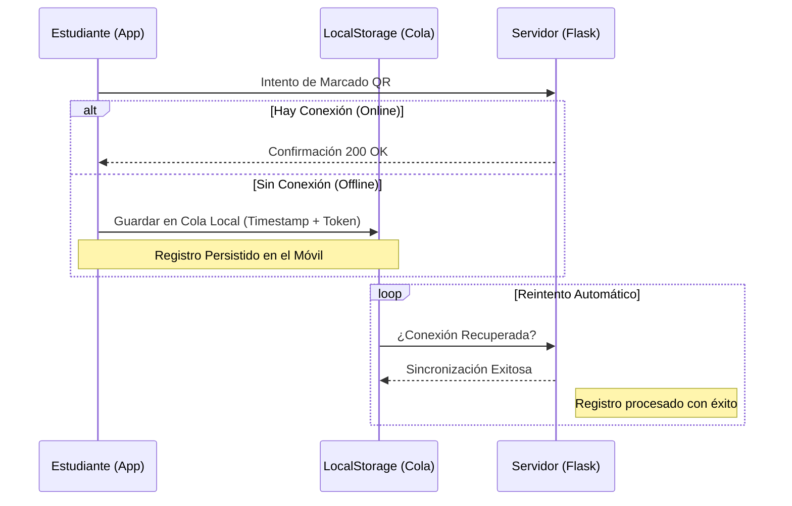

# 🛡️ Estrategias de Persistencia y Resiliencia
> **Arquitectura**: Offline-First | **Storage**: SQLite WAL + LocalStorage

Garantizar que ningún registro de asistencia se pierda es el objetivo primordial de nuestra infraestructura de datos. Implementamos redundancia y tolerancia a fallos en cada capa del sistema.

---

## 🗄️ 1. Persistencia en Servidor (SQLite WAL)

La base de datos central no es una implementación estándar; utiliza configuraciones de grado industrial para manejar picos de tráfico (ej: 40 estudiantes marcando en el mismo segundo).

### Configuración de Motor
> [!IMPORTANT]
> **WRITE-AHEAD LOGGING (WAL)**
> El modo WAL permite que los lectores no bloqueen a los escritores y viceversa. Es vital para que un docente pueda ver el dashboard en tiempo real mientras 40 alumnos están escribiendo en la base de datos simultáneamente.

**Parámetros de Optimización:**
```sql
PRAGMA journal_mode = WAL;    -- Alta concurrencia y velocidad.
PRAGMA synchronous = NORMAL;   -- Balance óptimo entre seguridad y rendimiento.
PRAGMA foreign_keys = ON;      -- Integridad referencial absoluta.
```

---

## 📡 2. Resiliencia en Cliente (Sincronización Offline)

El portal del estudiante está diseñado para funcionar en "Zonas Muertas" de señal (sótanos o salones blindados).

### Ciclo de Vida del Marcado Resiliente



---

## 🛠️ 3. Auditoría e Idempotencia

Para asegurar que los reintentos de red no generen datos basura, el sistema implementa **Idempotencia de Marcado**:

1.  **Rechazo de Duplicados**: El backend valida el par `(student_id, session_id)`. Si el registro ya existe (por un reintento previo exitoso), el servidor simplemente confirma la recepción sin crear filas duplicadas.
2.  **Timestamp de Auditoría**: Cada registro guarda el momento exacto de la creación en el móvil, permitiendo auditorías de tiempo real vs tiempo de sincronización.

> [!TIP]
> **Modo Desarrollador**: Puedes inspeccionar la cola de espera en cualquier momento abriendo la consola del navegador y consultando la clave `attendance_queue`.
